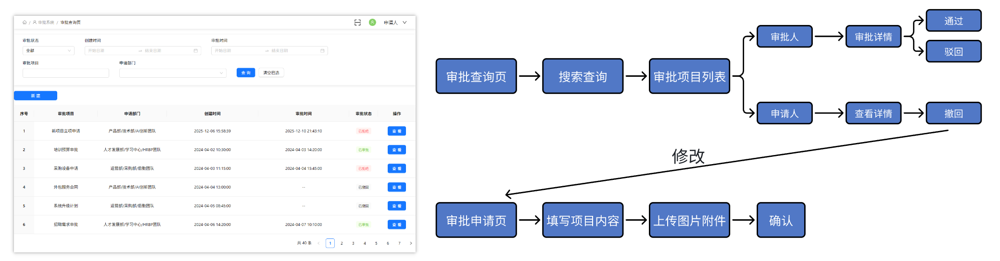

# 企业审批系统

## 1. 架构设计

### 1.1 系统架构图



### 1.2 架构说明

- **审批查询页**：查询项目列表（支持模糊和分页查询），通过抽屉形式对该项目进行操作
- **审批申请页**：新建项目，支持图片和excel附件上传功能
- **撤回**：若该项目没有被审批，支持撤回，若已审批，则不能撤回
- **修改**：只有当该项目没有被审批或者被驳回才能修改
- **图片上传**：支持JPG、PNG、GIF等格式，最大8MB

## 2. 核心功能模块设计

### 2.1 审批列表模块

#### 2.1.1 功能需求

- 展示所有审批单列表
- 支持按审批状态筛选
- 支持分页显示
- 点击审批单查看详情
- 支持审批操作（通过/拒绝）
- 支持撤回修改审批（申请人）

#### 2.1.2 实现思路

1. 使用`useState`管理审批列表数据和筛选条件
2. 使用`useEffect`在组件加载和筛选条件变化时获取数据
3. 使用Ant Design的Table组件展示审批列表
4. 实现审批状态的动态更新和视觉反馈
5. 使用React Router的`useLocation`和`useNavigate`处理页面跳转和来源追踪

#### 2.1.3 关键代码

```typescript
// 获取审批列表数据
useEffect(() => {
    console.log(prevRole, currentRole);
    // 判断是否是 currentRole 发生了变化
    const roleChanged = prevRole !== currentRole;

    // 如果角色变了，强制使用第 1 页
    const pageToUse = roleChanged ? 1 : currentPage;

    // 更新 ref
    // prevRoleRef.current = currentRole;
    dispatch(setPrevRole(currentRole));

    // 安全校验
    if (!currentRole || pageToUse < 1) return;

    // 构造参数
    const params = currentRole === '审批员'
      ? { status: ApprovalStatus.PENDING, currentPage: pageToUse }
      : { currentPage: pageToUse };
    // 如果角色变了，也要同步更新全局 currentPage 状态（可选，如果你有 UI 显示页码）
    if (roleChanged && pageToUse !== currentPage) {
      dispatch(setCurrentPage(pageToUse));
    }

    dispatch(fetchProjectList(params));
  }, [dispatch, currentRole, currentPage]);


const fetchProjectList = (params?: ApprovalListParams) => {
  return async (dispatch: Dispatch, getState: () => RootState) => {
    dispatch(setLoading(true));
    if (params?.currentPage) {
      dispatch(setQueryParams({
        ...getState().approval.queryParams,
        currentPage: params.currentPage,
      }));
    } else {
      dispatch(setQueryParams(params));
    }
    const res = await fetchApprovalListAPI(getState().approval.queryParams);
    console.log(res.data.list.length)
    dispatch(setProjectList(res.data));
    dispatch(setLoading(false));
  };
};
```

### 2.2 审批申请模块

#### 2.2.1 功能需求

- 填写审批表单（审批事项、部门、内容、执行日期等）
- 支持上传图片附件
- 提交审批申请
- 新建审批单后自动跳转至审批列表

#### 2.2.2 实现思路

1. 使用`useState`管理表单数据和文件列表
2. 使用Ant Design的Form组件实现表单校验
3. 使用Upload组件实现图片上传功能

#### 2.2.3 关键代码

```typescript
const onFinish = async (values: FormValues) => {
    console.log(values);
    if (fileList.length === 0) {
      message.error('请上传图片');
      return;
    }
    if (!excelFile) {
      message.error('请上传Excel文件');
      return;
    }
    const { approvalItem, approvalContent, approvalDepartment, approvalDate } = values;
    const queryParams = {
      approvalItem,
      approvalContent,
      approvalDepartment: approvalDepartment?.length ? approvalDepartment.join('/') : undefined,
      executionTime: approvalDate?.format('YYYY-MM-DD'),
      fileList: fileList,
      excelFile: excelFile,
    };
    if (SearchKey !== null) {
      await updateApprovalAPI(SearchKey!, queryParams);
      // 修改成功提示弹窗
      message.success('审批单更新成功');
      // 路由跳转到列表页，传递来源信息
      setTimeout(() => {
        navigate('/approval');
      }, 1000);
    } else {
      await createApprovalAPI(queryParams);
      message.success('审批单新建成功');
      setTimeout(() => {
        navigate('/approval');
      }, 1000);
    }
  };rn result.url;
  };
```

### 2.3 文件上传模块

#### 2.3.1 功能需求

- 支持上传图片文件
- 限制文件大小和类型
- 支持大图和删除已上传文件
- 实现图片加载状态显示

#### 2.3.2 实现思路

1. 使用Ant Design的Upload组件实现文件上传UI
2. 配置文件上传参数（大小限制、类型限制等）
3. 实现自定义上传列表项，显示加载状态
4. 使用腾讯云COS存储上传的文件
5. 使用`onChange`事件处理文件上传状态变化

#### 2.3.3 关键代码

```typescript
const uploadFileToServer = async (file: File): Promise<string> => {
    const formData = new FormData();
    formData.append('file', file);

    const res = await fetch('/api/upload', {
      method: 'POST',
      body: formData,
    });

    if (!res.ok) {
      throw new Error('上传请求失败');
    }

    const result = await res.json();
    if (!result.url) {
      throw new Error('服务器未返回文件地址');
    }

    return result.url;
  };
```

## 3. 关键技术点和解决方案

### 3.1 图片加载状态显示

#### 3.1.1 问题描述

在图片加载过程中，需要显示加载状态，提升用户体验。

#### 3.1.2 解决方案

1. 在图片预览和上传时设置加载状态
2. setFileList管理图片主要内容，例如status

#### 3.1.3 实现代码

```typescript
// 图片预览加载状态
const handleChange: UploadProps['onChange'] = async (e) => {
    const file = e.file.originFileObj;
    if (!file) return;

    // 添加 "uploading" 状态
    const tempUid = String(Date.now());
    const uploadingFile: FileItem = {
      uid: tempUid,
      name: file.name,
      status: 'uploading',
      url: '',
    };

    setFileList((prev) => [...prev, uploadingFile]);

    try {
      // 执行上传
      const url = await uploadFileToServer(file);

      // 上传成功：更新为 "done"
      setFileList((prev) =>
        prev.map((f) =>
          f.uid === tempUid
            ? { ...f, status: 'done', url }
            : f
        )
      );
    } catch (err) {
      // 上传失败：更新为 "error"
      setFileList((prev) =>
        prev.map((f) =>
          f.uid === tempUid
            ? { ...f, status: 'error' }
            : f
        )
      );
      message.error('图片上传失败：' + (err));
    }
  };
```

### 3.2 文件上传与云存储集成

#### 3.2.1 问题描述

需要安全可靠地存储用户上传的文件，同时减轻服务器存储压力。

#### 3.2.2 解决方案

1. 使用Multer中间件处理文件上传请求
2. 集成腾讯云COS SDK，将文件上传至云存储
3. 存储文件URL和元信息到数据库
4. 实现文件的安全访问控制

#### 3.2.3 实现代码

```javascript
const upload = multer({
  storage: multer.memoryStorage(), // 文件以 Buffer 形式存在内存中（适合上传到 COS/S3）
  limits: {
    fileSize: 10 * 1024 * 1024, // 限制 10MB
  },
});

// 文件上传配置
file.post('/upload', upload.single('file'), async (req, res) => {
  if (!req.file) {
    return res.status(400).json({ error: 'No file uploaded' });
  }

  const key = `${Date.now()}-${req.file.originalname}`;

  // 封装 putObject 为 Promise
  const putObject = (params) => {
    return new Promise((resolve, reject) => {
      cos.putObject(params, (err, data) => {
        if (err) {
          reject(err);
        } else {
          resolve(data);
        }
      });
    });
  };

  try {
    const result = await putObject({
      Bucket: 'approval-image-1376173969',
      Region: 'ap-chongqing',
      Key: key,
      Body: req.file.buffer,
      ContentType: req.file.mimetype,
    });

    const url = `https://${result.Location}`;
    res.json({ url });
  } catch (err) {
    console.error('COS Upload Error:', err);
    res.status(500).json({ error: 'Upload failed' });
  }
});
```
